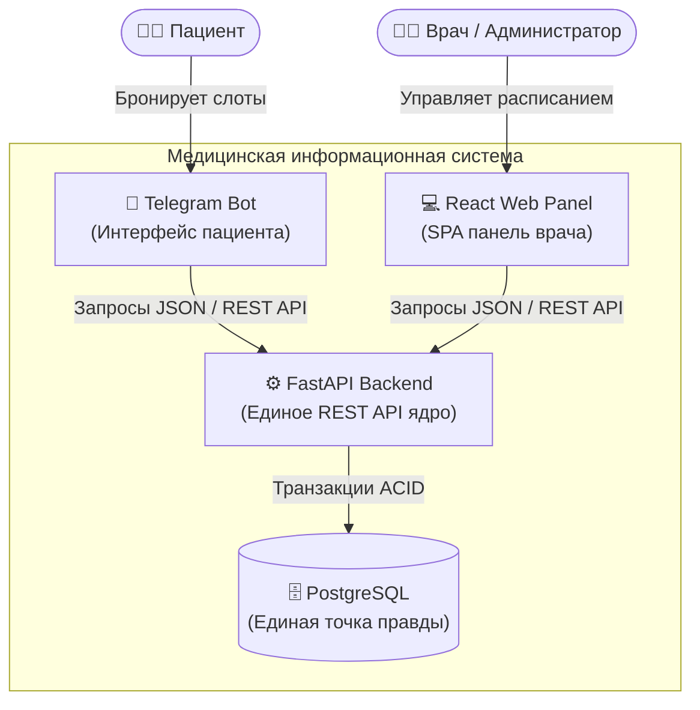
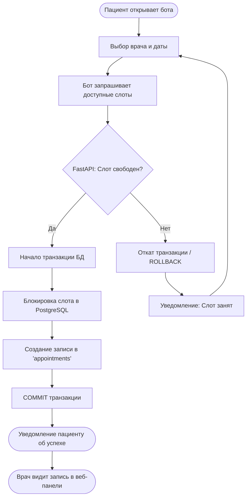
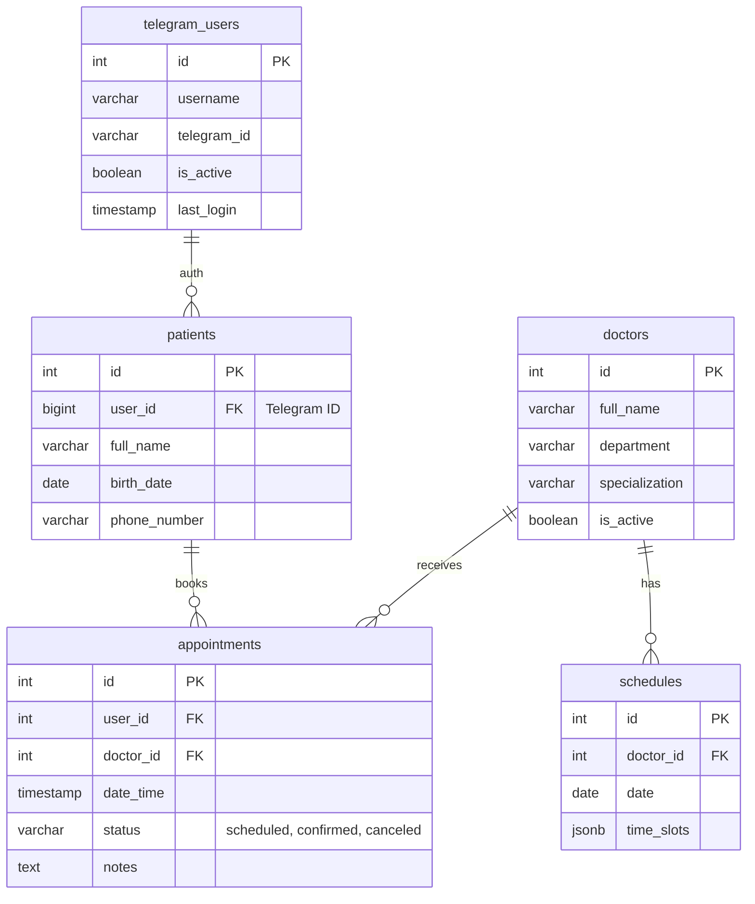

# Цифровая экосистема частной клиники

[](https://www.python.org/)
[](https://fastapi.tiangolo.com/)
[](https://react.dev/)
[](https://www.postgresql.org/)
[](https://core.telegram.org/bots/api)

**Статус:** Production с июля 2024  
**Роль:** Системный аналитик — полный цикл  
**Код:** закрыт по соображениям безопасности данных пациентов (NDA), репозиторий содержит архитектурную документацию и демонстрацию интерфейсов.

---

## Интерфейсы системы

### Интерфейс пациента (Telegram Bot)
*Выбор услуги, врача и свободного времени. Быстрая запись без звонков в регистратуру.*
<p align="center">
  
  &nbsp;&nbsp;&nbsp;&nbsp;
  
</p>

### Рабочий стол врача/администратора (React SPA)
*Мониторинг записей, управление статусами и карточками пациентов.*
<p align="center">
  
  <br><br>
  
  <br><br>
  
</p>

### Сетка расписания
*Единая точка управления слотами с мгновенной синхронизацией. Исключение двойных записей.*
<p align="center">
  
</p>

---

## Задача
До внедрения системы клиника сталкивалась с проблемами дублирования записей, ручного ведения расписания и потери заявок из-за разрозненности каналов коммуникации. 
Задачей было спроектировать и запустить отказоустойчивую централизованную экосистему, объединяющую Telegram-бота для пациентов и веб-панель для врачей с единой точкой правды в базе данных, а также оптимизировать производительность интерфейсов.

---

## Архитектура (C4 Context)

Ключевое решение: полная синхронизация двух каналов (Telegram Bot и React Web Panel) осуществляется строго через единые REST API эндпоинты на FastAPI. Это архитектурное ограничение исключает гонку данных при одновременной записи и обеспечивает мгновенное обновление интерфейсов для всех участников процесса.



---

## Процесс записи (Предотвращение коллизий)

Процесс спроектирован с учетом предотвращения коллизий. Блокировка слота и создание записи происходят в рамках одной транзакции базы данных (ACID), что делает физически невозможным дублирование записи на одно и то же время разными пациентами.



---

## Информационная модель (ERD)

База данных спроектирована по правилам нормализации. Ниже приведена схема основных сущностей, задействованных в процессе записи и управления расписанием (реальные поля из production БД).



---

## Результаты
* **Оптимизация производительности:** Показатель **Lighthouse Score вырос с 65 до 95+** за счет правильной конфигурации SPA (React + Vite) и кэширования статики на уровне Nginx.
* **Стабильность:** Система успешно введена в эксплуатацию и работает у заказчика без замечаний с июля 2024 года.

---

## Технологический стек
* **Backend:** Python, FastAPI, SQLAlchemy
* **Frontend:** React 18, Vite, Tailwind CSS
* **Database:** PostgreSQL
* **Integration:** Telegram Bot API (aiogram)
```
